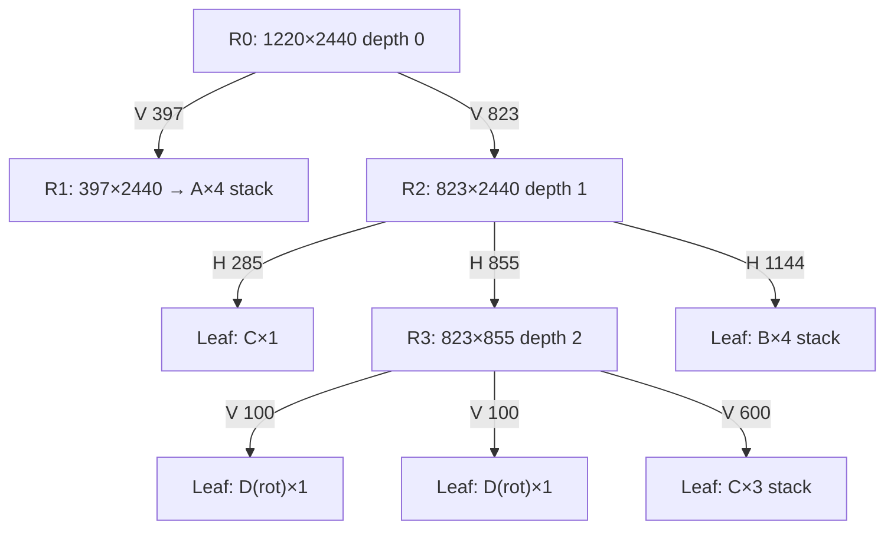

# 현재 idea.md의 Guillotine Partition Planner 평가와 권장 설계

## Executive summary

업로드된 idea.md는 현재 엔진을 사실상 `row-first strip`으로 보고, 계단형 잔여공간 문제, 관통 절단 절대 규칙, 단일 폭 후보만으로는 부족하다는 점을 정확히 짚고 있다. 방향 자체는 맞다. 다만 현재 문서에는 구현상 가장 중요한 명세 하나가 빠져 있다. 바로 **회전 허용 여부를 부품별로 명시하는 것**이다. 문헌은 회전 허용(RG)과 회전 금지(OG)를 서로 다른 문제 subtype으로 명확히 구분한다. 따라서 현재 문서처럼 “회전 허용 시”를 보조 문구로만 두는 방식은 구현 명세로는 불충분하다. fileciteturn0file0 citeturn13view1turn6view2turn8view0

본 보고서에서 guillotine slicing-DP로 재검증한 결과, **Case2·Case3·Case4는 90도 회전이 허용되면 모두 1220×2440 한 장에 guillotine packing이 가능**했다. 반대로 **회전이 금지되면 세 케이스 모두 한 장 해가 존재하지 않았다**. 즉, 현재 설계의 성패는 “더 똑똑한 분할” 이전에 “지금 풀고 있는 문제가 RG인지 OG인지”에 달려 있다. 이 점이 가장 큰 발견이다. 이는 guillotine feasible layout가 “사각형을 edge-to-edge cut으로 재귀 분할해 얻는 배치”라는 정의와, 회전/비회전 guillotine variant를 별도로 다루는 기존 연구 흐름과도 일치한다. citeturn6view2turn8view0turn13view1

개발 우선순위도 이에 맞게 바뀌어야 한다. 현재 idea.md가 폐기한 **pure vertical-column solver**는 다시 살릴 필요가 없지만, 반대로 바로 “깊은 범용 재귀 탐색”으로 갈 필요도 없다. 이번 검증으로 발견한 one-sheet 패턴들은 모두 **얕은 깊이의 recursive guillotine tree**로 설명된다. 따라서 실용적인 1순위는 **부품별 rotation flag를 명시한 뒤, depth 4 이내의 shallow recursive planner + micro-group generator + beam search + legacy fallback**을 구현하는 것이다. 고전적 tree-search, 재귀 exact guillotine procedure, MIP, CP 모델도 모두 이 방향과 정합적이다. citeturn8view2turn6view0turn6view1turn6view2

Case1은 별도 예외다. 현재 첨부 문서와 대화에서 확인 가능한 정보만으로는 **Case1의 상세 BOM이 부족**해 exact 수치 시뮬레이션을 수행할 수 없다. 그러므로 Case1은 지금도 idea.md가 적어 둔 것처럼 **기존 AREA_TARGET_HYBRID 유지**가 맞다. 다만 이것은 “검증된 최적”이라기보다 “데이터 부족 상태에서의 안전한 보수적 판단”이다. fileciteturn0file0

## 입력과 exact 시뮬레이션

이 보고서의 exact 시뮬레이션은 **guillotine slicing-DP**로 수행했다. 상태는 “남은 부품 멀티셋”이고, DP는 각 상태에 대해 가능한 **Pareto-optimal bounding boxes**를 저장한다. 단일 부품은 허용 orientation의 박스로 시작하고, 두 하위 상태의 box를 `vertical concat = (w1+w2, max(h1,h2))` 또는 `horizontal concat = (max(w1,w2), h1+h2)`로 결합한다. 이 방식은 guillotine packing의 slicing-tree 성질과 정확히 대응하며, 문헌의 recursive exact guillotine construction과 같은 계열이다. citeturn6view0turn8view0turn6view2

```text
DP[∅] = {(0,0)}

for state S in increasing item count:
    if |S| = 1:
        DP[S] = allowed_orientations(single_item)
    else:
        cand = ∅
        for every partition S = A ⊎ B:
            for boxA in DP[A]:
                for boxB in DP[B]:
                    cand += (boxA.w + boxB.w, max(boxA.h, boxB.h))
                    cand += (max(boxA.w, boxB.w), boxA.h + boxB.h)
        DP[S] = ParetoPrune(cand)

feasible iff ∃ (w,h) ∈ DP[AllItems] with w ≤ 1220 and h ≤ 2440
```

현재 대화와 첨부 문서 기준으로 확보 가능한 입력은 아래와 같다. Case1은 상세 BOM이 없다. Case4는 대화 중 사용자 제공값을 사용했다.

| Case | 판재 | 부품 목록 |
|---|---:|---|
| Case1 | 1220×2440 가정* | 복합 7종, 상세 BOM 미제공 |
| Case2 | 1220×2440 | 600×900 × 5 |
| Case3 | 1220×2440 | 400×1000 × 7 |
| Case4 | 1220×2440 | A 397×596 × 4, B 771×286 × 4, C 600×285 × 4, D 770×100 × 2 |

\* Case1은 현재 아이디어 문서와 대화에서 상세 부품 치수가 확인되지 않아 exact simulation 불가.

다음 표는 핵심 수치 결과다.

| Case | 총 부품 수 | 총 면적 | 판재 대비 면적률 | 단순 vertical-column 원방향 시뮬레이션 | 회전 허용 exact guillotine 1장 | 회전 금지 exact guillotine 1장 |
|---|---:|---:|---:|---|---|---|
| Case1 | 불명 | 불명 | 불명 | 불명 | 불명 | 불명 |
| Case2 | 5 | 2,700,000 | 90.7% | 600폭 2컬럼 × 각 2적층 = 4개 | 가능 | 불가 |
| Case3 | 7 | 2,800,000 | 94.1% | 400폭 3컬럼 × 각 2적층 = 6개 | 가능 | 불가 |
| Case4 | 14 | 2,666,472 | 89.6% | A열 4개 + 우측 원방향 naive single-file B/C/D는 13/14에서 실패 | 가능 | 불가 |

Case2와 Case3는 정확히 사용자가 지적한 오류가 맞았다. **vertical-column만으로는 각각 4개, 6개까지만 가능**하다. 그러나 회전을 허용하면 shallow guillotine pattern으로 각각 5개, 7개를 모두 넣을 수 있다.

### Case2의 exact witness

| 영역 | 규격 | 적층/배치 | 수용 개수 |
|---|---|---|---:|
| 상단 band | 900×600 회전 | 1개 | 1 |
| 하단 column 1 | 600×900 | 2적층 | 2 |
| 하단 column 2 | 600×900 | 2적층 | 2 |
| 합계 | 1200×2400 tight box |  | 5 |

```text
Case2, rotation ON

┌─────────────────────────────── 1220 ───────────────────────────────┐
│  [ 900×600 rot ]                                    waste 320×600 │ 600
├───────────────────────┬───────────────────────┬────────────────────┤
│      600×900          │      600×900          │        waste       │
│      600×900          │      600×900          │                    │ 1800
└───────────────────────┴───────────────────────┴────────────────────┘
tight box = 1200×2400
```

### Case3의 exact witness

| 영역 | 규격 | 적층/배치 | 수용 개수 |
|---|---|---|---:|
| 상단 band | 1000×400 회전 | 1개 | 1 |
| column 1 | 400×1000 | 2적층 | 2 |
| column 2 | 400×1000 | 2적층 | 2 |
| column 3 | 400×1000 | 2적층 | 2 |
| 합계 | 1200×2400 tight box |  | 7 |

```text
Case3, rotation ON

┌─────────────────────────────── 1220 ───────────────────────────────┐
│        [ 1000×400 rot ]                             waste 220×400  │ 400
├───────────────┬───────────────┬───────────────┬────────────────────┤
│    400×1000   │   400×1000    │   400×1000    │                    │
│    400×1000   │   400×1000    │   400×1000    │                    │ 2000
└───────────────┴───────────────┴───────────────┴────────────────────┘
tight box = 1200×2400
```

### Case4의 exact witness

Case4는 current idea.md의 직관이 완전히 틀린 것은 아니었다. **A 전용 column을 먼저 분리하는 패턴 자체는 회전이 허용되면 실제로 가능**하다. 다만 우측 영역의 B/C/D는 원방향 single-file이 아니라 **재귀적 band/column 조합**으로 들어간다.

| 영역 | 규격 | 적층/배치 | 수용 개수 |
|---|---|---|---:|
| 좌측 A column | 397×596 | 4적층 | 4 |
| 우측 상단 band | 600×285 | 1개 | 1 |
| 우측 중단 block | 100×770 회전 2열 + 600×285 3적층 | D 2개 + C 3개 | 5 |
| 우측 하단 block | 771×286 | 4적층 | 4 |
| 합계 | 1197×2384 feasible box |  | 14 |

```text
Case4, rotation ON, A-first feasible witness

┌──── 397 ────┬────────────────────── 800 ───────────────────────────┐
│ A 397×596   │ C 600×285                                           │ 285
│ A 397×596   ├────100────┬────100────┬──────────600───────────────┤
│ A 397×596   │ D 100×770 │ D 100×770 │ C 600×285                  │
│ A 397×596   │           │           │ C 600×285                  │ 855
│             │           │           │ C 600×285                  │
│             ├─────────────────────────────────────────────────────┤
│             │ B 771×286                                          │
│             │ B 771×286                                          │ 1144
│             │ B 771×286                                          │
│             │ B 771×286                                          │
└─────────────┴─────────────────────────────────────────────────────┘
feasible inside 1220×2440
```

Case4에는 더 조밀한 1191×2338 witness도 존재했지만, 위 A-first witness가 current idea.md의 직관과 가장 직접적으로 연결되므로 구현 판단용 사례로 더 유용하다.

Case1은 BOM이 없기 때문에 배치도와 exact simulation을 작성하지 않았다. 이 상태에서는 Case1에 대해 “새 로직으로 더 좋아진다”거나 “더 나빠진다”고 단정하면 오히려 과장이다.

## 현재 idea.md에 대한 평가

현재 idea.md의 장점은 분명하다. 첫째, **vertical-column-only 가설이 Case2/3에서 틀렸다는 점을 명시적으로 수정**했다. 둘째, **guillotine 절대 규칙**을 유지했다. 셋째, **단일 폭 후보만으로는 부족하고 조합 폭이 필요하다**는 점을 문서화했다. 이 세 가지는 모두 올바른 수정이다. fileciteturn0file0

문제는 그 다음 단계다. 문헌은 2D guillotine 문제에서 **orientation constraint**와 **guillotine constraint**를 별개로 취급하고, 회전 허용 RG와 회전 금지 OG를 명확히 분리한다. 현재 idea.md에는 이 구분이 구현 인터페이스로 승격되어 있지 않다. 그런데 이번 exact simulation은 **바로 이 옵션이 Case2·Case3·Case4의 one-sheet feasibility를 뒤집는다**는 사실을 보여 주었다. 따라서 이 문서의 가장 큰 빈칸은 “회전 허용 여부를 부품별 boolean flag로 명시하는 것”이다. citeturn13view1turn6view2

또 하나의 보완점은 용어다. 현재 문서는 “컬럼 폭 후보”라는 표현을 자주 쓴다. 그러나 Case2와 Case3의 실제 해는 **horizontal-first**이고, Case4의 실제 witness도 `V → H → V` 교대 절단이다. 따라서 구현 관점에서는 “컬럼 폭 후보”보다 **분할 길이 후보**라는 표현이 더 정확하다. 즉, vertical split에는 폭 후보를, horizontal split에는 높이 후보를 생성해야 한다. 이 점은 arbitrary-stage alternating guillotine model을 다루는 CP 논문과도 더 잘 맞는다. citeturn6view2

Case4에 대해 문서가 적어 둔 “2-stage vertical partition”은 절반만 맞다. **첫 큰 분할을 세로로 시작하는 후보는 유효**하다. 하지만 strict한 의미의 two-stage로 고정하면 너무 좁다. 이번에 찾은 A-first witness는 `root vertical → right horizontal bands → middle vertical subcolumns`의 **교대 절단**이 필요하다. 즉, 실무적으로 필요한 것은 `2-stage vertical solver`가 아니라 **shallow recursive guillotine planner**다. 이 차이는 작아 보이지만 구현에서는 매우 크다. citeturn8view0turn6view2

개발 우선순위도 재평가할 필요가 있다.

| 항목 | 재평가 |
|---|---|
| Rotation/Orientation 모델 | **최우선**. RG/OG가 바뀌면 feasibility 자체가 뒤집힘 |
| Pure vertical-column solver | **폐기 유지**. Case2/3 원인 분석은 맞음 |
| 깊은 일반 재귀 탐색 | 바로 1순위는 아님 |
| 얕은 recursive guillotine + group boxes | **실제 1순위** |
| Case1 신규 적용 | 보류. BOM 부족으로 기존 AREA_TARGET_HYBRID 유지 |

정리하면, current idea.md는 “문제 인식”은 좋지만 “문제 subtype의 명세”와 “실제 구현 단위”가 아직 분리되어 있지 않다. 이 문서는 설계 메모로는 충분하지만, 바로 코딩을 시작하기에는 아직 인터페이스와 종료 규칙이 모자란다.

## 후보 생성과 그룹핑 설계

### 후보 생성 규칙 검증

분할 후보는 다음 네 층으로 만들어야 한다.

| 후보 층 | 반드시 포함해야 하는가 | 예시 |
|---|---|---|
| 단일 치수 | 예 | 600, 400, 397 |
| 회전 치수 | 예 | 900, 1000, 286 |
| 폭/높이 합산 | 예 | 295+295=590, 286+286=572 |
| micro-group exact box | 강력 권장 | 100+100+600=800, 397×3=1191, 286+286+600=1172 |

핵심은 **pair sum만으로 충분하지 않다**는 점이다. Case4의 우측 witness는 `100 + 100 + 600 = 800` 폭과, `285×3 = 855` 높이가 동시에 필요하다. 이것은 단순한 “부품 폭 2개 합”이 아니라, **작은 guillotine subtree의 bounding box**다. 그러므로 후보 생성의 단위는 “부품 폭”이 아니라 **micro-group box**여야 한다. 이 방향은 recursive exact guillotine construction과 general guillotine MIP/CP의 모델링 관점과도 자연스럽게 맞물린다. citeturn6view0turn6view1turn6view2

단순 sum enumeration만 써도 폭발이 시작된다. 본 분석에서 회전 허용, 최대 3개 조합까지만 보아도 raw 후보 수는 다음과 같았다.

| Case | raw width 후보 수 | raw height 후보 수 | 의미 |
|---|---:|---:|---|
| Case2 | 3 | 7 | 작음 |
| Case3 | 4 | 8 | 작음 |
| Case4 | 71 | 149 | pruning 없이는 inner loop 폭발 |

따라서 “조합 폭을 다 넣자”는 발상은 맞지만, 구현은 반드시 **생성 후 강한 pruning**으로 가야 한다.

### 권장 후보 생성 알고리즘

```text
GenerateCutCandidates(rect R, remaining items Q, allowRotate):
    boxes = []

    # atomic boxes
    for each item type t with remaining demand:
        for each allowed orientation o of t:
            if o fits inside R:
                boxes += Box({t:1,o}, w=o.w, h=o.h)

    # micro-group boxes
    seedTypes = selectTopTypes(Q, by = large area / large width / high demand)
    for each multiset G with |G| <= GMAX and types(G) <= TYPEMAX:
        B = ExactMiniGuillotineBoxes(G, allowRotate)
        for each pareto box b in B:
            if b fits inside R and fill(b) >= MIN_FILL:
                boxes += b

    boxes = DominancePrune(boxes)

    V = unique({b.w for b in boxes})
    H = unique({b.h for b in boxes})

    V = topK(V, by = verticalCandidatePriority)
    H = topK(H, by = horizontalCandidatePriority)

    return V, H
```

여기서 `ExactMiniGuillotineBoxes(G)`는 최대 4~5개 부품만 대상으로 하는 작은 exact DP다.

```text
ExactMiniGuillotineBoxes(group G):
    DP[empty] = {(0,0)}
    for each sub-multiset S of G in increasing size:
        if |S| = 1:
            DP[S] = allowed_orientations(item in S)
        else:
            cand = ∅
            for every partition S = A ⊎ B:
                for boxA in DP[A], boxB in DP[B]:
                    cand += (boxA.w + boxB.w, max(boxA.h, boxB.h))
                    cand += (max(boxA.w, boxB.w), boxA.h + boxB.h)
            DP[S] = ParetoPrune(cand)
    return DP[G]
```

이 접근의 장점은 **295+295=590** 같은 단순 pair case도 잡고, **100+100+600=800** 같은 mixed group도 잡으며, 불필요한 폭 후보를 Pareto prune으로 자연스럽게 줄일 수 있다는 점이다.

### 컬럼 내부 그룹핑 로직

그룹핑은 다음 순서로 구체화하는 것이 좋다.

| 그룹 타입 | 생성 조건 | 예시 | 용도 |
|---|---|---|---|
| 단일 column stack | 같은 child rect 안에 세로 적층 가능 | 600×900 ×2, 397×596 ×4 | Case2, Case4의 A열 |
| 단일 row group | 같은 child rect 안에 가로 병렬 가능 | 397×596 ×3 → 1191×596 | Case4 하단 A 3개 row |
| narrow-column bundle | 좁은 회전 부품을 병렬로 묶음 | 286+286=572 | Case4의 B rotated twin |
| mixed micro-group | exact mini-DP로 생성 | 100+100+600=800, 높이 855 | Case4의 D+D+C3 block |

그룹 우선순위는 아래처럼 두는 것이 실용적이다.

```text
groupPriority =
    0.35 * fillRatio(groupBox)
  + 0.25 * axisMatch(groupBox, currentRect)
  + 0.20 * demandCoverage(group)
  + 0.20 * futureSlackAfterPlacement
```

- `fillRatio = packedArea / boxArea`
- `axisMatch = box.h/H` for vertical-first candidates, `box.w/W` for horizontal-first candidates
- `demandCoverage = consumedCount / remainingCount`
- `futureSlackAfterPlacement = leftoverGeomFitScore`

295+295 사례는 반드시 unit test로 강제해야 한다. 예를 들면 `[(295,800), (295,800)]`가 남아 있을 때, 후보 생성 단계에서 **590폭**이 나오지 않으면 그 생성기는 실패다. 같은 방식으로 Case4에서는 **1191폭**, **800폭**, **1172폭**이 나오지 않으면 실패다.

## 점수 함수와 재귀 제어

### 첫 절단 평가 함수

첫 절단은 “지금 무엇이 잘 들어가나”가 아니라, “이 절단 이후에도 남은 공간이 살아 있나”를 평가해야 한다. 이를 위해 아래 다섯 개 성분을 추천한다.

\[
U_{\text{axis}} =
\begin{cases}
h_g / H_R & \text{vertical-first candidate}\\
w_g / W_R & \text{horizontal-first candidate}
\end{cases}
\]

여기서 \(g\)는 cut 이후 child rectangle 안에 실제로 packed된 best group이다. pure column인 경우 \(U_{\text{axis}}\)는 사용자가 원한 `합 높이 / 판재 높이`와 정확히 일치한다.

\[
E_{\text{box}} = \frac{\text{packed area in chosen child}}{\text{area of tight group box}}
\]

\[
F_{\text{geom}} =
\frac{\sum_t d_t^{rem}\cdot \mathbf{1}\big[\exists R\in \mathcal{L},\exists o\in O_t:
w_{to}\le W_R \land h_{to}\le H_R\big]}
{\sum_t d_t^{rem}}
\]

\[
C_{\text{future}} =
\frac{\sum_t \min\left(d_t^{rem}, \widehat{cap}_t(\mathcal{L})\right)}
{\sum_t d_t^{rem}}
\]

여기서 \(\widehat{cap}_t(\mathcal{L})\)는 **작은 leftover에 대해서는 exact mini-solver**, 큰 경우에는 빠른 proxy로 계산한다.

\[
P_{\text{dead}} =
\frac{\sum_{R\in \mathcal{L}} area(R)\cdot \mathbf{1}\big[\forall t,o,\; w_{to}>W_R \vee h_{to}>H_R\big]}
{\sum_{R\in \mathcal{L}} area(R)}
\]

최종 점수는 다음처럼 두는 것을 권한다.

\[
\text{Score} =
0.20 U_{\text{axis}}
+0.15 E_{\text{box}}
+0.25 F_{\text{geom}}
+0.30 C_{\text{future}}
+0.10 B_{\text{bal}}
-0.25 P_{\text{dead}}
-0.05 P_{\text{frag}}
-0.03 P_{\text{rot}}
\]

권장 해석은 다음과 같다.

- `U_axis`: 현재 strip/column이 얼마나 축 방향으로 차는가
- `E_box`: 그룹 자체가 얼마나 깔끔한가
- `F_geom`: 남은 직사각형들이 최소한 다른 부품들을 수용할 “자격”이 있는가
- `C_future`: 실제로 남은 부품들을 얼마나 많이 먹을 수 있는가
- `B_bal`: 지나치게 찌그러진 반쪽 분할을 약하게 벌점
- `P_dead`: 아무 것도 못 넣는 공간 비율
- `P_frag`: open rectangle 수가 늘어나는 정도
- `P_rot`: 회전을 싫어하는 제조 환경이라면 약한 벌점

이 점수식에서 가장 중요한 것은 `C_future`다. Case4에서 이를 잘 보여 준다.  
- `V=397` A-first cut은 residual width 823에서 **남은 부품 전체가 exact-feasible**였다.  
- 반대로 `V=771` first cut은 residual width 449에서 **남은 A/C/D가 exact-infeasible**였다.  

즉, local fit만 보면 B 771폭도 커 보여서 매력적이지만, leftover future packability를 넣는 순간 A-first가 훨씬 낫다. 이 기능이 없으면 점수식은 다시 “큰 것 먼저”의 함정으로 돌아간다.

### 재귀 깊이와 종료 조건

문헌에는 arbitrary-stage alternating guillotine model도 있지만, online heuristic에 그대로 가져오면 탐색량이 급증한다. CP는 arbitrary-stage를 다루고, MIP는 pseudopolynomial variable/constraint로 medium-size instance를 겨냥한다. 반면 online scoring loop에서는 가볍고 예측 가능한 제한이 필요하다. citeturn6view2turn6view1

권장 파라미터는 아래와 같다.

| 파라미터 | 온라인 권장 | 오프라인 검증 모드 | 이유 |
|---|---:|---:|---|
| `MAX_RECURSION_DEPTH` | **4** | 5 | Case2/3 witness는 depth 3, Case4는 straightforward tree로 depth 4 필요 |
| `GMAX` micro-group size | 4 | 5 | current benchmark 충분 |
| beam width `B` | 4 | 8 | 품질/시간 균형 |
| cut candidates per direction | 12 | 20 | Case4 raw 후보 폭발 억제 |
| node budget per sheet | 500 | 2000 | < 1 s 목표 |
| wall-clock per sheet | 300 ms target, 1 s hard | 5–10 s | 실무 응답성 |
| transposition table size | 5k states | 20k states | 메모리 예측 가능 |

종료 조건은 적어도 아래 8개가 필요하다.

1. `depth >= MAX_RECURSION_DEPTH`이면 **즉시 legacy local packer** (`guillotineCutA/B` 또는 안전한 strip filler)로 위임  
2. 남은 수요가 0이면 종료  
3. 현재 rectangle에 들어갈 수 있는 orientation이 하나도 없으면 종료  
4. `remaining total area > open rectangles total area`면 불가능 prune  
5. 후보 cut set이 비면 종료  
6. time budget 초과 시 종료  
7. node budget 초과 시 종료  
8. 동일 canonical state 재방문 시 prune

동일 상태 반복 방지는 아래 canonical key를 쓰면 된다.

```text
stateKey =
(
  sorted(open_rectangles by (area, w, h)),
  remaining_demands in canonical item order,
  depth,
  rotation_flags
)
```

`seen[key] = bestPackedAreaSoFar`를 저장하고, 같은 key에 더 나쁜 packed area로 들어오면 즉시 prune한다.

또 하나 중요한 점은 **강한 lower bound를 inner loop에 남용하지 않는 것**이다. Dual-feasible lower bounds는 강력하지만 일부 클래스는 \(O(n^3)\), \(O(n^4)\) 시간이 필요하다. 이런 계산은 nightly validator나 offline proof에는 좋지만, online first-cut scorer의 매 node에는 과하다. citeturn6view5

### Case4 재귀 트리 예시



이 예시는 strict two-stage가 아니라 **얕은 재귀 guillotine**이라는 점을 보여 준다.

## 성능 분석과 대안 알고리즘

### 성능과 복잡도

후보 생성을 잘 prune하지 않으면 naive branching은 금방 커진다. 단순화하면 branch factor를 \(C\), depth를 \(D\)라 할 때 DFS worst-case는 대략 \(O(C^D)\)다. 예를 들어 `C=12`, `D=4`면 **20,736**개의 cut sequence가 생긴다. 여기에 child-local packing까지 곱해지면 충분히 폭발한다.

반면 beam width \(B\)를 두면 실제 평가는 보통 \(O(B \cdot C \cdot D)\) 수준으로 떨어진다. 권장값 `B=4`, `C=12`, `D=4`이면 대략 수백 수준의 state expansion으로 제어 가능하다. 현재 검증한 Cases 2–4는 모두 이 범위 안에서 충분히 다룰 수 있는 shallow instance다. 따라서 production target은 **평균 300 ms 내외, hard limit 1 s/판재**가 현실적이다.

메모리는 transposition table 기준으로 수천~수만 state면 충분하다. state 하나에 frontier rectangles, remaining demands, score upper bound만 넣으면 **수 MB 수준**으로 제어 가능하다. 이 범위를 넘기기 시작하면 탐색 품질보다 pruning 설계가 먼저 문제라고 봐야 한다.

### 대안 알고리즘 비교

고전 tree-search와 현대 exact/heuristic 스펙트럼을 보면, 현재 프로젝트에 현실적인 선택지는 아래 네 가지다. 1977년의 tree-search, 2012년 recursive exact guillotine procedure, 2016년 general guillotine MIP, 2023년 arbitrary-stage CP, 2025년 beam-search strip packing, 1995/2008년 GA 계열이 각각 다른 trade-off를 제공한다. citeturn8view2turn6view0turn6view1turn6view2turn10search4turn13view0turn13view1

| 대안 | 핵심 아이디어 | 장점 | 단점 | 구현 난이도 | 예상 성능 | 권장 적용 |
|---|---|---|---|---|---|---|
| Best-first recursive guillotine + beam search | 현재 아이디어를 가장 자연스럽게 구현 | 기존 엔진과 결합 쉬움, deterministic 가능 | heuristic tuning 필요 | 중 | **온라인 최적** | 본 프로젝트 주력 |
| MILP / ILP | general guillotine restrictions를 MIP로 모델링 | exact proof, infeasibility 증명 가능 | medium-size 넘어가면 느릴 수 있음 | 중상 | 오프라인 강함 | validator, benchmark baseline |
| CP / CP-SAT | recursive region assignment와 stage alternation 모델링 | arbitrary-stage 표현이 자연스러움 | solver tuning 필요 | 상 | small/medium exact 강함 | 난해한 소형 케이스 증명 |
| GA / SA hybrid + guillotine repair | 순열/패턴을 진화시키고 feasibility repair | 다양한 해를 탐색, 지역최적 탈출 | 비결정적, 회귀 테스트 어려움 | 중상 | 오프라인 다양화에 강함 | 2차 탐색기, diversification |

**권장 결론은 분명하다.**  
주력은 `best-first recursive guillotine + beam search`로 가고, **MILP/CP는 validator**로 두는 것이 가장 실용적이다. GA/SA hybrid는 deterministic heuristic이 plateau를 보일 때만 추가하는 편이 낫다.

## 안전성, 회귀 정책, 로드맵

현재 프로젝트의 최우선 원칙은 안정성이다. 그 기준에서 아래 정책을 권한다.

첫째, **기존 `guillotineCutA()`와 `guillotineCutB()`는 수정하지 않는다.** 새 로직은 완전 별도 함수로 둔다. 둘째, **새 로직이 더 나쁠 때는 무조건 기존 결과를 채택**한다. 셋째, **동일한 결과면 기존 결과 우선**으로 두어 회귀를 최소화한다. 넷째, node depth cap에 도달했을 때도 단순 fail이 아니라 **legacy local packer**로 넘겨서 안전하게 종료한다.

테스트와 벤치마크는 세 층으로 나누는 것이 좋다. exact methods survey와 2DPackLib는 외부 benchmark 구성을 위한 좋은 출발점이다. 2DPackLib는 25개 benchmark와 3000개 이상 instance를 정리해 두었다. citeturn15search0turn15search8

| 테스트 층 | 필수 항목 |
|---|---|
| 단위 테스트 | 295+295=590 후보 생성, 397×3=1191 생성, 100+100+600=800 생성, rotation flag on/off |
| 시뮬레이터 검증 | Case2/3/4 exact one-sheet RG/OG 판정, witness reproducibility |
| 회귀/성능 테스트 | 기존 케이스 총 판재 수, trim loss, runtime p50/p95, item order permutation invariance |

특히 아래 네 항목은 반드시 자동화해야 한다.

- **Case2 RG**: 1장 가능  
- **Case2 OG**: 1장 불가  
- **Case3 RG**: 1장 가능  
- **Case3 OG**: 1장 불가  
- **Case4 RG**: 1장 가능  
- **Case4 OG**: 1장 불가  
- **Case1**: 기존 AREA_TARGET_HYBRID 결과 불변

권장 로드맵은 다음과 같다.

| 단계 | 산출물 | 예상 기간 | 주요 리스크 |
|---|---|---:|---|
| 프로토타입 | exact slicing-DP validator, rotation flag 모델 | 2–3일 | Case1 BOM 부재 |
| 시뮬레이터 | candidate generator, micro-group DP, unit tests | 3–4일 | 후보 폭발 |
| 온라인 플래너 | beam search, score function, depth control, memoization | 4–5일 | runtime tuning |
| 통합/회귀 | legacy fallback, A/B compare, benchmark harness | 3–4일 | 품질은 좋아도 runtime이 불안정할 수 있음 |
| 검증 강화 | MILP/CP validator 일부 케이스 연결 | 3–5일 | solver integration |

### Open questions / limitations

Case1은 현재 대화에서 **상세 BOM이 없어서 exact 수치 시뮬레이션을 수행할 수 없었다**. 이 한계 때문에 Case1에 대해서는 “기존 AREA_TARGET_HYBRID 유지”라는 보수적 판단만 가능하다. 또한 kerf, 절단 순서 시간, grain direction, 금형/칼날 교체 비용 같은 제조 제약은 현재 idea.md와 본 분석 모두 모델에 넣지 않았다. 만약 실제 생산이 orientation-sensitive라면, 이번 보고서에서 **RG에서 feasible로 나온 Case2·Case3·Case4도 OG 정책에서는 즉시 infeasible**로 바뀐다. 따라서 최종 구현 전에 부품별 `allowRotate`를 명세에 올리는 일이 가장 먼저다.